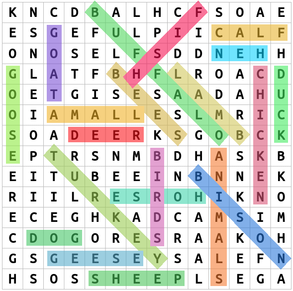

# word-search-solver
This Python program solves word search puzzles by first extracting the puzzle grid and word list from an image using PaddleOCR. It detects the grid layout, recognizes all characters, and then searches for the given words in all 8 directions (horizontal, vertical, and diagonal). The program highlights the found words, making it easy to visualize the solution.

# Input


<br>
[Example Input](https://thewordsearch.com/puzzle/7/farm-animals)

# Output


# Usage
1. Clone the repository
```bash
git clone https://github.com/MalithaBandara/word-search-solver.git
```
2. Navigate to the project directory
```bash
cd word-search-solver
```
3. Install dependencies
```bash
pip install -r requirements.txt
```
4. Replace `assets/grid.png` with the image of the grid
5. Replace `assets/words.png` with the image of the word list
6. Run main.py
```bash
python main.py
```
7. Find the solved puzzle at `assets/output.png`
